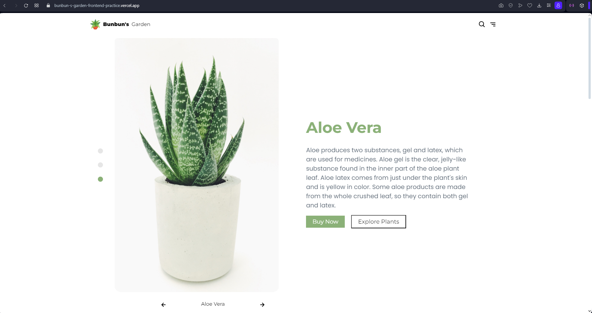

# Front-End Practice - Figma Design File to Code

Practice for creating a responsive web design from a figma design.

## Table of contents

- [Overview](#overview)
  - [The challenge](#the-challenge)
  - [Screenshot](#screenshot)
  - [Links](#links)
- [My process](#my-process)
  - [Built with](#built-with)
- [Author](#author)

## Overview

### The challenge

The website should have:

- View the optimal layout for the site depending on their device's screen size (responsive)
- See hover states for all interactive elements on the page like buttons
- AOS animations

### Screenshot

### Links

- Live Site URL: (https://bunbun-s-garden-frontend-practice.vercel.app)

## My process

I used vite in creating this practice project. The first thing I did was to analyze the design file and plan how I can implement the components needed. Once I was done with research, I created a vite project and wrote the contents of the html. Then I started regrouping the elements I thought belongs to the same group to make my layout. After that, I added class to the elements, I tried implementing the BEM naming for this project. Then I proceeded with styling. I separated each section with their own css files to avoid clutter and keep the code organized. I used the desktop-first approach and that's when I realized it was a lot more complicated to handle than mobile-first. 

### Built with

- Semantic HTML5 markup
- CSS custom properties
- Flexbox
- CSS Grid
- Desktop workflow

## Author

- Website - [TrishaCapitle](github.com/trishacapitle)

